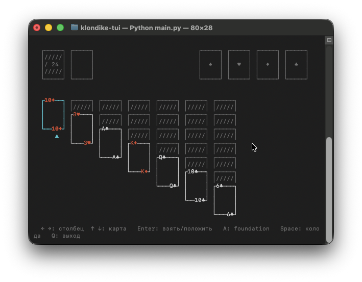

# Solitaire TUI

Klondike Solitaire running in your terminal, built with Python and `curses`.



## Run

```bash
python3 main.py
```

No dependencies — standard library only.

## Controls

| Key | Action |
|---|---|
| `← →` | Move between columns |
| `↑ ↓` | Select card / switch rows |
| `Enter` | Pick up / place card |
| `A` | Send card to foundation |
| `Space` | Draw from stock |
| `Esc` | Cancel selection |
| `N` | New game |
| `Q` | Quit |

## Rules

Standard Klondike:

- **Tableau** — 7 columns. Cards are placed in descending order, alternating color (red on black). Only a King can start an empty column.
- **Stock / Waste** — press `Space` or `Enter` on the stock to flip the top card to the waste pile.
- **Foundation** — 4 suits stacks. Goal is to build each suit from Ace to King.

## Structure

```
main.py   — TUI rendering and input handling
game.py   — game logic (deck, move validation)
```
